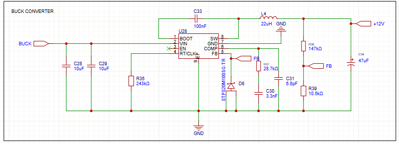
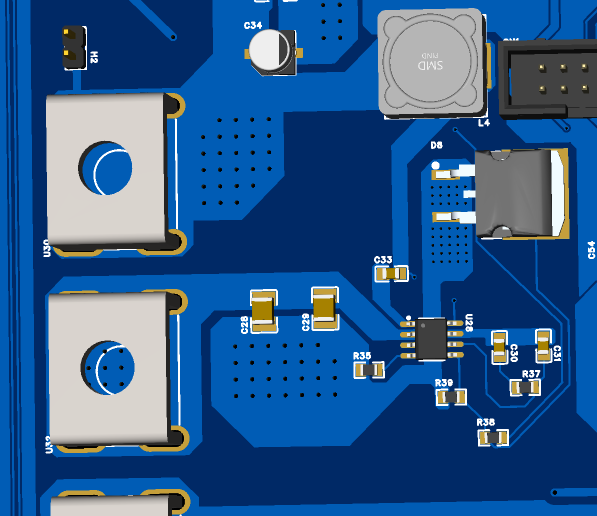
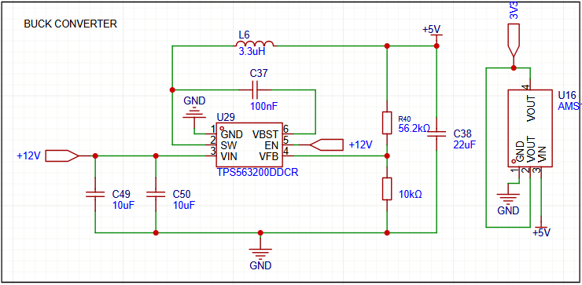
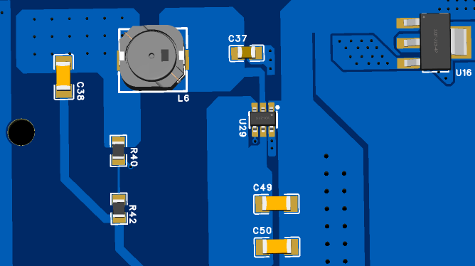
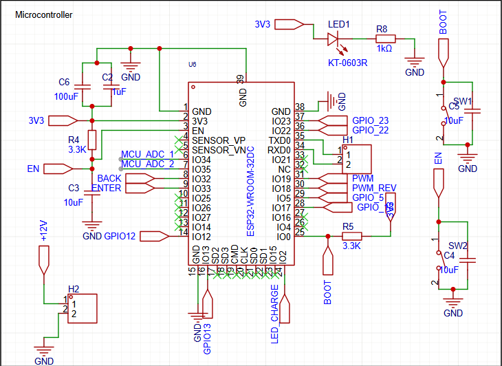
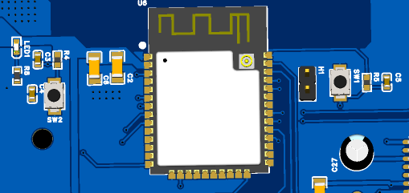
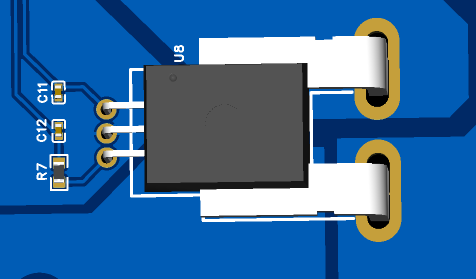
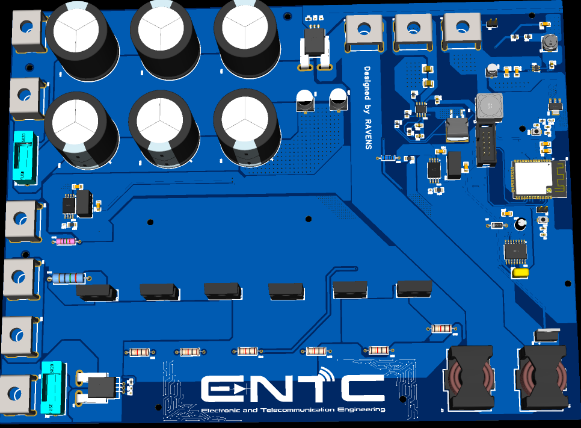
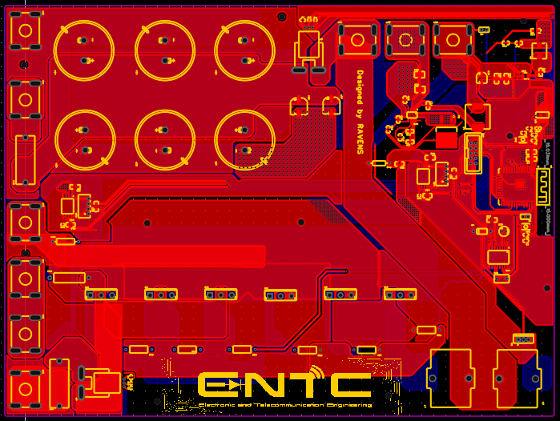
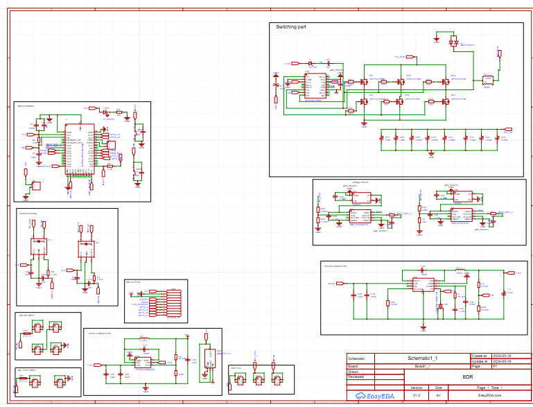

# ☀️ Solar Charge Controller with Basic MPPT

Ongoing hardware design project for a modular solar charge controller with basic Maximum Power Point Tracking (MPPT). The system focuses on efficient DC-DC conversion, real-time sensing, and a scalable control architecture for renewable energy applications.

## Overview

This project explores the design and development of a solar charge controller with basic MPPT for efficient energy harvesting and battery charging. It is built around a modular power electronics architecture with embedded control capability for future expansion.

The design emphasizes efficient DC-DC conversion, real-time sensing, and robust hardware implementation for renewable energy systems.

## Power Architecture

### 60V → 12V Buck Converter

- High-voltage solar input step-down stage
- Designed for stable and efficient conversion
- Focused on low losses and thermal stability
- Supports variable solar input conditions

**Schematic**  


**PCB Layout**  


### 12V → 5V Buck Converter (5A Capability)

- Dedicated power rail for control electronics and peripherals
- Designed for high-current operation up to 5A
- Stable output for ESP32 and sensor modules
- Optimized PCB routing for power integrity

**Schematic**  


**PCB Layout**  


## Control Hardware

### ESP32 Integration

- ESP32-based control platform for system management
- PWM output interface for power stage control
- GPIO expansion for sensing and control signals
- Modular design for future firmware integration

**ESP32 Schematic**  


**ESP32 PCB Layout**  


## Sensing Hardware Design

### Voltage Sensing Circuit

- Scaled voltage divider network for ADC interfacing
- Designed for high-voltage monitoring on solar and battery sides
- Focused on accuracy and noise reduction

**Voltage Sensing Schematic**  


**Voltage Sensing PCB**  


## System Highlights

- Modular dual buck converter architecture
- Independent power stages for improved reliability
- Clean separation of power and control sections
- Designed for scalability and real-world deployment
- Optimized PCB layout for power electronics

## Hardware Design Workflow

- System architecture planning
- Power stage design using buck converter topologies
- Component selection and validation
- Schematic design
- PCB layout and routing
- Design rule checks (DRC)
- Gerber generation for fabrication
- Hardware testing and validation

## My Contributions

- Designed the 60V → 12V high-efficiency buck converter stage
- Designed the 12V → 5V buck converter with 5A output capability
- Selected key power and control components
- Designed the complete PCB layout and routing
- Developed voltage and current sensing hardware circuits
- Integrated the ESP32-based control hardware interface
- Ensured manufacturability and design optimization

## Project Gallery

<p align="center">
  
  
  
</p>

## Applications

- Solar energy charging systems
- Off-grid power systems
- Battery management system prototyping
- Embedded power electronics platforms
- Renewable energy research projects

## Skills Demonstrated

- Power electronics design
- DC-DC converter design using buck topology
- PCB design for high-power systems
- Analog sensing circuit design
- Embedded hardware integration with ESP32
- Design for manufacturability (DFM)

## Future Improvements

- Synchronous buck converter design for higher efficiency
- Improved thermal management system
- Integrated protection circuits for OVP, OCP, and reverse polarity
- Advanced MPPT hardware optimization
- Enclosure design for field deployment

## Repository Structure

```text
MPPT-Solar-Charger/
├── images/
│   ├── 3D_SOLAR.png
│   ├── PCB_SOLAR.png
│   ├── SCH_SOLAR.png
│   ├── 60vsch.png
│   ├── 60vbuckpcb.png
│   ├── 12vsch.png
│   ├── 12vbuckpcb.png
│   ├── esp322sch.png
│   ├── ESP32pcb.png
│   ├── voltage sensing sch.png
│   └── VOLTAGE_SENSING.png
└── README.md
```

## Status

This project is part of ongoing work in embedded systems and power electronics, focusing on renewable energy hardware design and practical solar energy optimization systems.
